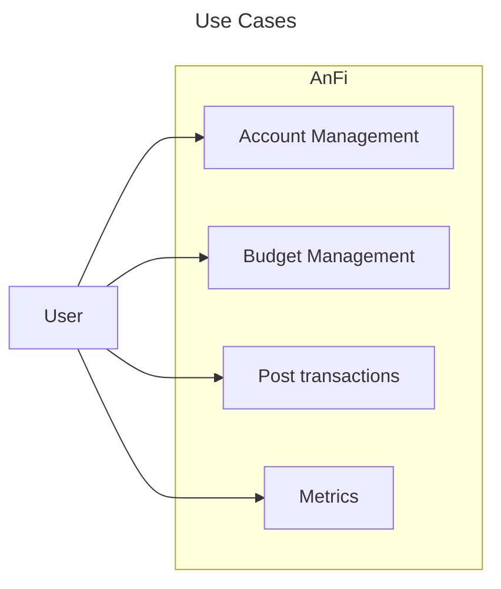
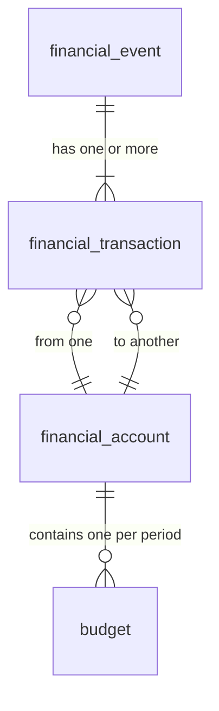

# Design

This is the central design document for AnFi.

## Use Cases

```mermaid
---
title: Use Cases
---
flowchart LR
    user[User]

    subgraph anfi [AnFi]
        account_management[Account Management]
        budget_management[Budget Management]
        post_transaction[Post transactions]
        metrics[Metrics]
    end

    user --> account_management
    user --> budget_management
    user --> post_transaction
    user --> metrics
```

## Logical Data Models

```mermaid
erDiagram
    financial_account
    budget
    financial_event
    financial_transaction

    financial_account ||--o{ budget: "contains one per period"
    financial_event ||--|{ financial_transaction: "has one or more"
    financial_transaction }o--|| financial_account: "from one"
    financial_transaction }o--|| financial_account: "to another"
```
